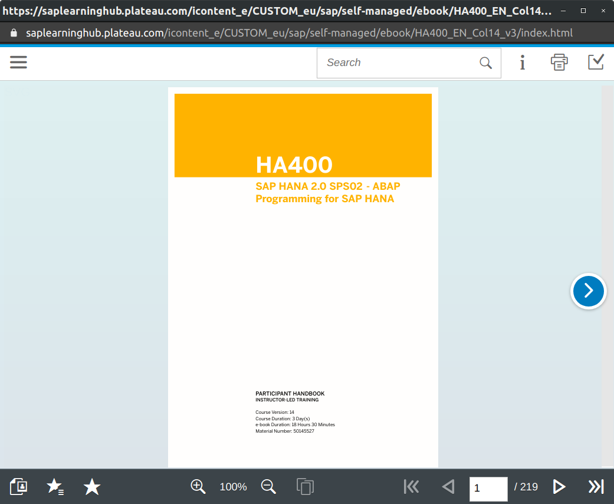

# saplearninghub-pdf-downloader-gui

Download eBook from SAP Learning Hub using GUI

## Getting Started

## Prerequisite

Having Google Chrome installed.
The path of chrome.exe should be put in `Chrome path`. These are the default paths depending on your os (they are set by default):

- Windows : `C:\Program Files (x86)\Google\Chrome\Application\chrome.exe`
- Linux : `/usr/bin/google-chrome`

The path of the downloader script (build result of [saplearninghub-pdf-downloader](https://github.com/AZn5ReD/saplearninghub-pdf-downloader)) should be put in `Downloader path`. By default it should be bundled in the archive with the executable file.

## Installation

```bash
npm install
```

## Usage

Get the eBook URL from the SAP LearningHub and put it on the `Ebook link`.

The download URL of the eBook URL is on the learning hub:



Fill the `User` and `Password` inputs with your SUSER / SUSER_PASSWORD.

## Test

You can only test the GUI. The download will only work if you have the build downloader and fill the `Downloader path` correctly.

```bash
npm run debug
```

## Build

To build the node script in the `dist` folder

```bash
npm run build
```

Then build the webpacked file with [@nodegui/packer](https://github.com/nodegui/packer)

```bash
npx nodegui-packer --init saplearninghub-pdf-downloader-gui
npx nodegui-packer --pack dist
```

## Build With

- [nodegui](https://github.com/nodegui/nodegui) - A library for building cross-platform native desktop applications with Node.js and CSS
- [nodegui-packer](https://github.com/nodegui/packer) - Package and deploy apps built with NodeGui to all platforms
- [webpack](https://github.com/webpack/webpack) - A bundler for javascript and friends.

## Contributing

Pull requests are welcome. For major changes, please open an issue first to discuss what you would like to change.

## Side notes

What I couldn't achieve:

- Bundle the saplearninghub-pdf-downloader into the executable file (maybe due to webpack and/or packer ?). The goal was to start a node child process but it looks like it needs another file.

## License

[MIT](https://choosealicense.com/licenses/mit/)
